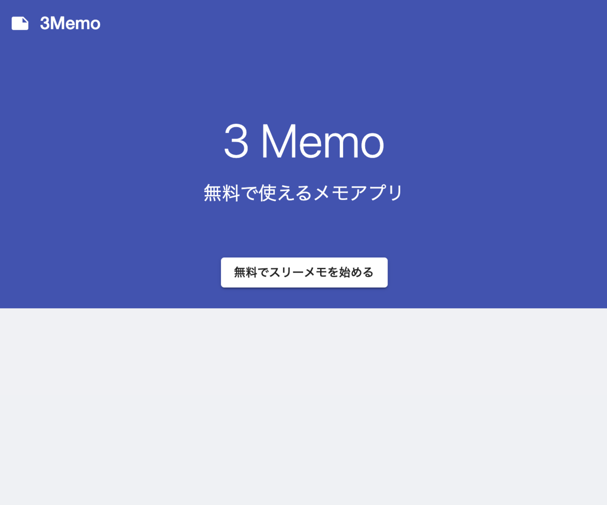
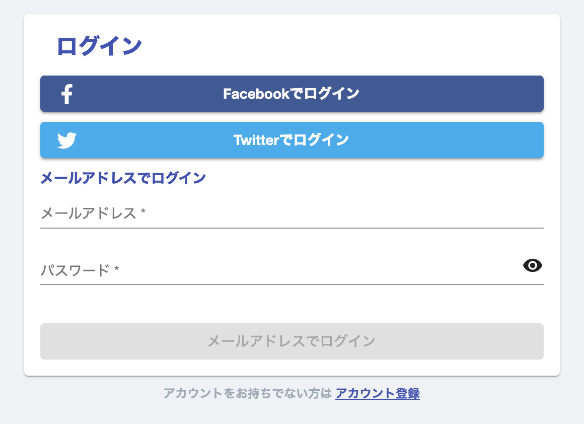
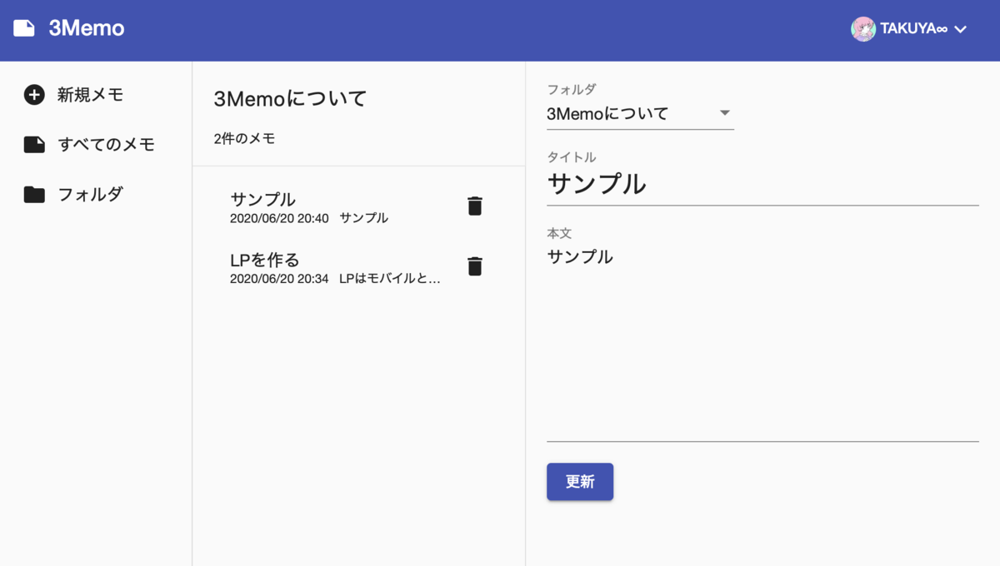

# 3memo | スリーメモ



## スリーメモとは

無料で使えるメモアプリ、リンクは[こちら](https://taikin.web.app)

ブログの紹介記事は[こちら](https://www.l08084.com/entry/2020/06/20/205542)

## スリーメモの機能

スリーメモの機能について紹介します。

### SNS 認証



Facebook と Twitter のアカウントを持っている場合は、SNS のアカウントを使ってスリーメモのアカウント登録・認証を実施することができます。

### フォルダ



フォルダを作成することでメモを分類ごとに整理することができます。

## Run Things Locally

```bash
git clone https://github.com/l08084/three-memo
cd three-memo
npm install -g @angular/cli
npm install
ng serve
# open your browser on http://localhost:4200/
```
